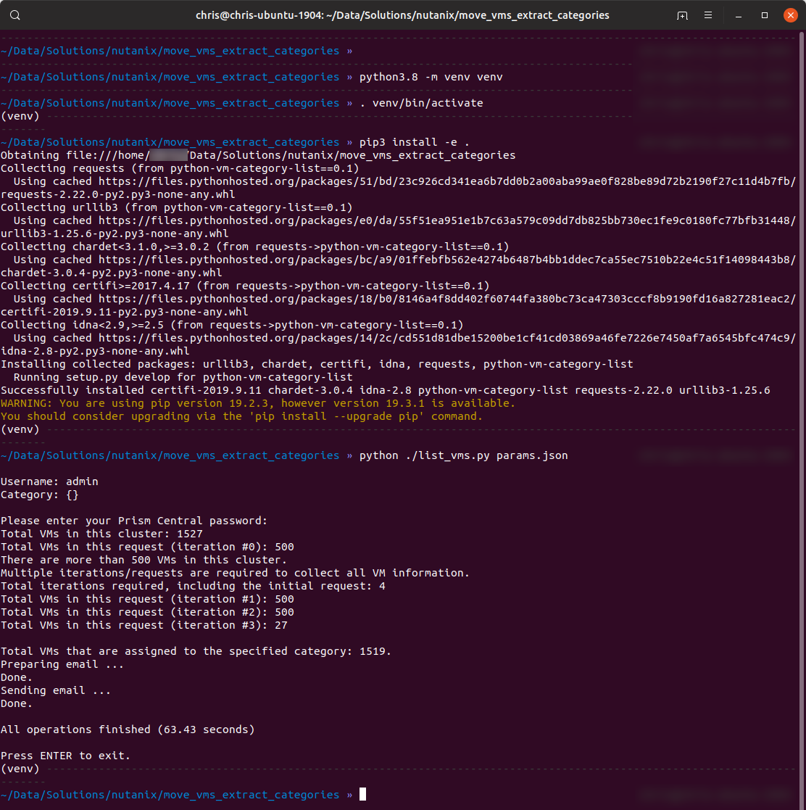

===================================
List VMs Matching Category Criteria
===================================

- Use included params.json as API request parameters
- List all VMs that are currently assigned to the specified category (see formatting notes in next section)
- Email completed list to specified email address

----------------------------
Specifying Category Criteria
----------------------------

- VMs with no category assigned: use **{}** in parameters file
- VMs in specific category: use **{"category_name_demo":"category_value_demo"}** in parameters file

---------------
Important Notes
---------------

- This script has been written for demo purposes only.  *Please* make sure to add appropriate error-checking and exception handling before using it in production.
- For use in production it would advisable to add better exception handling for email/SMTP errors.

------------
Requirements
------------

- Python >=3.6 (lower versions will NOT work)
- pip3 (for dependencies installation)
- Tested on Python 3.6, 3.7 and 3.8

-----
Usage
-----

- Clone repo to your local machine
- Setup a virtual environment on Linux or Mac (strongly recommended):

   .. code-block:: python

      python3.8 -m venv venv
      . venv/bin/activate

- Setup a virtual environment on Windows (strongly recommended):

   .. note:: See https://docs.python.org/3/library/venv.html for Windows instructions

- Install the dependencies:

   .. code-block:: python

      pip3 install -e .

- Adjust values in **params.json** to match your Prism Central, category and SMTP settings
- Run the script:

   .. code-block:: python

      python3.8 list_vms.py params.json

-------
Support
-------

Please be advised this script is **unofficial** and meant for demo/reference purposes only.  It is not officially supported by Nutanix in any way.

----------
Screenshot
----------

An example of the script running is shown below.

